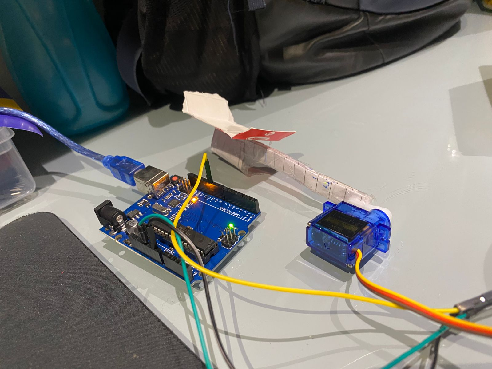

# 🐾 Automatic Dog Treat Dispenser 🐾

**Because every furry friend deserves a treat as soon as they walk through the door!**

---

## Overview

This is a fun little project I built to make sure your pup is greeted with love (and treats) automatically!  

Whenever my dog Rio walks into view, the system detects him using a tiny AI-powered camera and releases a treat using a servo motor. No more waiting, no more missed tail wags—just instant joy! 🐶💖

---

## How It Works

1. **AI Detection:**  
   - A camera continuously monitors the room.
   - I used a YOLOv8 model to detect my dog in real time.
   - Only triggers once every 4 seconds to avoid spamming treats.

2. **Servo Mechanism:**  
   - An Arduino UNO R3 controls a small servo motor.
   - The servo is attached to a makeshift hand that pushes treats out.
   - When the dog is detected, the servo swings, delivering the treat.

3. **WebRTC Streaming (Optional):**  
   - You can stream the camera feed to a frontend to see real-time detection.
   - This makes debugging and monitoring super fun!  

---

## Tech Stack

- **Python 3**  
- **FastAPI** for the backend  
- **aiortc** for real-time video streaming  
- **OpenCV** for camera capture and image handling  
- **Ultralytics YOLO** for dog detection  
- **PySerial** for Arduino communication  

---

## Hardware Setup

Here's a rough idea of the setup (replace with your own photo!):

- Arduino UNO R3  
- Servo motor attached to a tiny "hand"  
- Treat dispenser mechanism  
- (Literally a servo with a makeshift hand)

---

## Features

- Automatic treat dispensing when dog detected  
- 4-second cooldown to prevent overfeeding  
- Optional live video stream to watch your dog get happy!  
- Fun AI + robotics combo for pet lovers 🐾  

---

## Future Improvements

- Add multiple treat sizes and dispenser speeds  
- Add a camera on the treat hand for better aiming  
- Make it fully wireless and app-controlled  

---

**Because every pup deserves a little magic at the door!** 🎉🐶  
